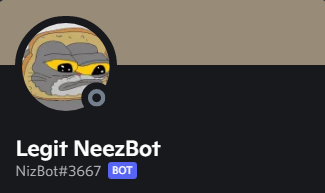

  

Discord bot made for a friend's server.

# Features
- Utilizes ffmpeg and ytdownloader to play music
- Allows for building and maintaining of custom music playlists.
- Periodically sends memes to desired channel
- Custom replies to specific users
- Custom replies to messages

# Commands
- add \[playlist name] \[song name] - Adds a song to the playlist
- remove \[playlistname] \[song name] - Removes a song from the playlist
- create \[playlist name] - Creates a playlist
- delete \[playlist name] - Deletes a playlist
- play \[playlist name] - Plays a playlist
- dc - Leaves voice channel
- prefix \[newPrefix] - Change prefix
